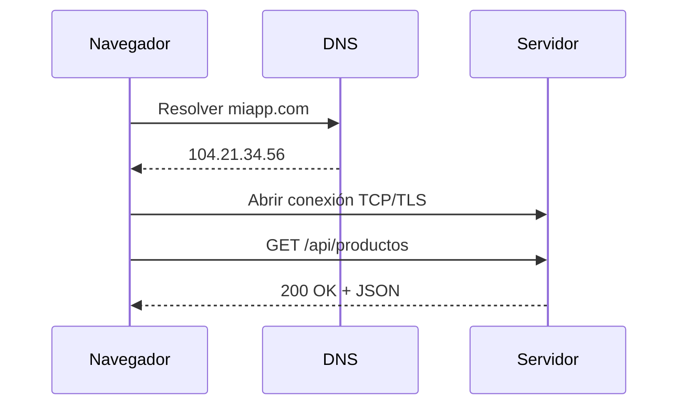

## El viaje de una petición

Cuando hacés clic en un link o tu app necesita datos, el navegador inicia un **request de red**: un viaje de ida y vuelta hasta el [servidor](/servidores) para obtener lo que necesita (una página HTML, una imagen, datos JSON de una API). Aunque parece instantáneo, detrás de cada petición hay varios pasos que se ejecutan en milisegundos.

## Anatomía de un request

Cuando el navegador necesita cargar `https://miapp.com/api/productos`, pasa todo esto:

1. **Resolución [DNS](/dns)**: El navegador traduce `miapp.com` a una dirección IP (ej: `104.21.34.56`). Si ya la tiene en caché, se saltea este paso.
2. **Conexión TCP**: Se establece una conexión con el servidor mediante un proceso llamado **TCP handshake** (literalmente, un "apretón de manos"). Son tres mensajes rápidos (SYN, SYN-ACK, ACK) donde el navegador y el servidor se confirman mutuamente que están listos para comunicarse.
3. **TLS handshake**: Si es [HTTPS](/http-https), se negocia la encriptación (el "candadito" que ves en la barra del navegador). El navegador verifica el certificado del servidor y se acuerdan las claves para que nadie pueda espiar la comunicación.
4. **Envío del request**: El navegador envía la petición HTTP con el método, los headers y (si corresponde) el body.
5. **Procesamiento en el servidor**: El servidor recibe la petición, la procesa (consulta la base de datos, ejecuta lógica, etc.) y prepara la respuesta.
6. **Respuesta**: El servidor devuelve los datos con un status code, headers y el contenido.

Si lo simplificás al máximo, el recorrido se ve así:



Y cuando esa conversación ya llegó a HTTP, los mensajes se parecen más a esto:

```http
GET /api/productos HTTP/1.1
Host: miapp.com
Accept: application/json
```

```http
HTTP/1.1 200 OK
Content-Type: application/json

[
  { "id": 1, "nombre": "Mate" }
]
```

La idea importante es esta: antes de que tu app reciba datos, primero hay que encontrar el servidor, abrir una conexión y recién después intercambiar mensajes HTTP.

## Latencia y performance

La **latencia** es el tiempo que tarda un request en ir y volver. Depende de varios factores:

- **Distancia física**: Un servidor en Buenos Aires responde más rápido a un usuario en Argentina que uno en Japón.
- **Tamaño de la respuesta**: Transferir una imagen de 5 MB tarda más que un JSON de 2 KB.
- **Tiempo de procesamiento**: Si el servidor tiene que hacer consultas pesadas a la [base de datos](/base-de-datos), la respuesta tarda más.
- **Cantidad de requests**: Cargar una página puede disparar decenas de requests (HTML, CSS, JS, imágenes, fuentes, APIs). Cada uno suma tiempo.

## DevTools: tu mejor aliado

El panel **Network** de las DevTools del navegador (F12 o Cmd+Option+I) te muestra todos los requests que hace tu página. Para cada uno podés ver:

- **Nombre y URL** del recurso pedido.
- **Método y status code** (GET 200, POST 201, etc.).
- **Tamaño** de la respuesta.
- **Tiempo** que tardó cada fase (DNS, conexión, espera, descarga).
- **Waterfall**: Un gráfico que muestra cuándo arrancó y terminó cada request.

El waterfall es especialmente útil: si ves muchos requests apilados uno después de otro (en vez de en paralelo), probablemente hay oportunidades de optimización.

## Optimizaciones comunes

Para que tu app cargue rápido, hay varias estrategias relacionadas con los requests de red:

- Usar **cache** del navegador para no repetir requests innecesarios.
- **Comprimir** las respuestas con gzip o brotli (algoritmos que reducen el tamaño de los archivos para que viajen más rápido por la red).
- Servir archivos estáticos desde un [CDN](/cdn) para reducir la distancia física.
- Minimizar la cantidad total de requests agrupando recursos.

Cada milisegundo cuenta para la experiencia del [usuario en el frontend](/cliente-frontend).
